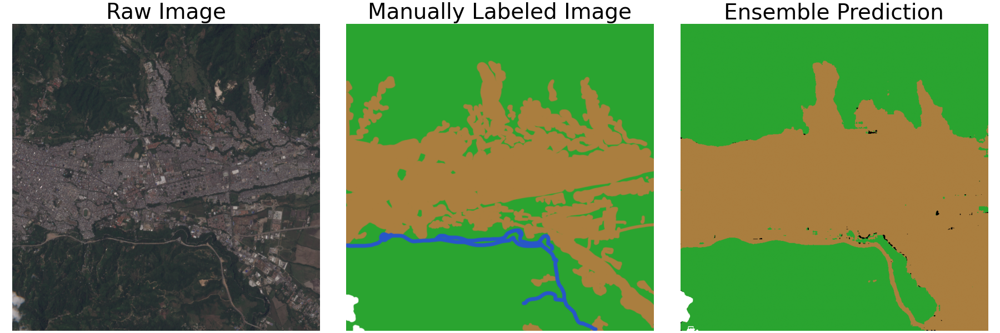

# Semantic Segmentation of Satelitte Images



## Description
This project provides a framework to semantically segment satellite images using multiple text prompts. It is built upon the single-prompt framework of [**segment-geospatial**](https://samgeo.gishub.org/text_sam/#samgeo.text_sam.LangSAM.predict).

## Installation
To set up this project, clone the repository to your local machine and ensure that you have Jupyter Notebook installed to run `.ipynb` files.

```bash
git clone https://github.com/dsridaran/SatelliteSemanticSegmentation.git
cd SatelliteSemanticSegmentation
```

## Usage

### Preprocessing Data

Raw TIFF images from Sentinel-2 can be sourced from [**MITCriticalData**](https://huggingface.co/MITCriticalData).

Before performing segmentation, preprocess the raw data by running the following Jupyter notebook:

```bash
jupyter notebooks process_images.ipynb
```

This script will preprocess the raw TIFF images into RGB, gamma-adjusted, and tiled images. The gamma-adjusted images have enhanced brightness for improved global segmentation. Tiles can be optionally used to improve segmentation within localized sections of images.

### Segmentation

Segmentation is performed using the following Jupyter notebook:

```bash
jupyter notebook run_models.ipynb
```

**Example: RGB/Gamma Approach**

To segment a single image, with a single prompt, use the following code for RGB images:

```bash
train_individual_model(
    sam = sam,
    image = "image_73001_2018-03-04", folder = "rgb",
    prompt = "building", bt = 0.3, tt = 0.3, object_being_predicted = "Urban",
    save_images = False, save_results = False
)
```

or this code for gamma-enhanced images:

```bash
train_individual_model(
    sam = sam,
    image = "image_73001_2018-03-04", folder = "gamma",
    prompt = "building", bt = 0.3, tt = 0.3, object_being_predicted = "Urban",
    save_images = False, save_results = False
)
```

**Example: Ensemble Approach**

To segment a single image, with multiple prompts, use the following code for RGB images:

```bash
train_ensemble_model(
    sam = sam, image = "image_76001_2018-12-16",
    urban_prompt = "building", cloud_prompt = "cloud", tree_prompt = "vegetation", water_prompt = "",
    bt = 0.1, tt = 0.1,
    save_images = False, save_results = False
)
```

## Data Structure

The expected inputs for the segmentation are as follows:

- ```data/raw/XXX.TIFF```: Raw TIFF images from Sentinel-2.
- ```data/labeled/XXX.png```: Manually labeled images. Labeling has been performed using Adobe Photoshop.
- ```data/rgb/XXX.png```: RGB images that are created by ```process_images.ipynb```.
- ```data/gamma/XXX.png```: Gamma-enhanced images that are created by ```process_images.ipynb```.
- ```data/tiles/XXX.png```: Tiled images that are created by ```process_images.ipynb```.

## Contact

For questions or support, please contact dilan.sridaran@gmail.com.
